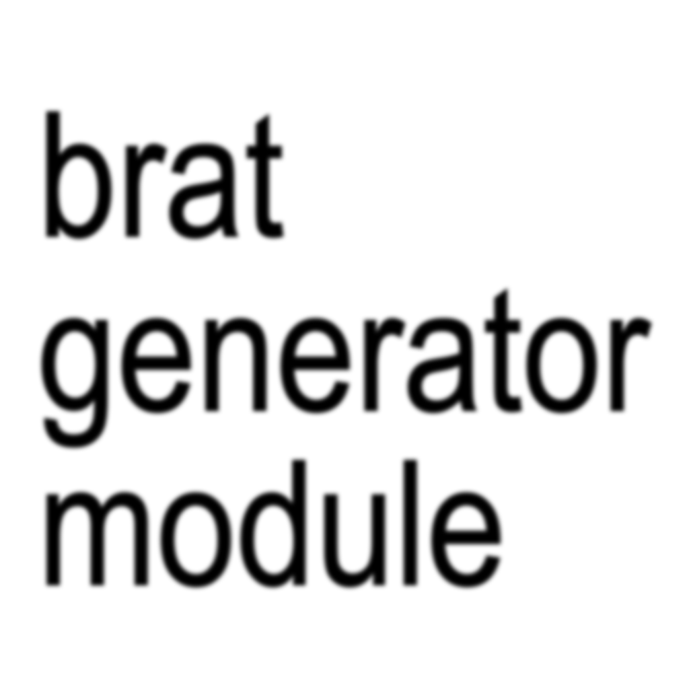

# brat

`brat` is a small JavaScript package for generating brat-style square PNG images without a browser, scraper, or remote rendering service. It renders SVG text with a bundled font and converts it to PNG through [Sharp](https://sharp.pixelplumbing.com/).



## Features

- Browserless rendering powered by Sharp.
- ESM module API for JavaScript projects.
- CLI for quick image generation.
- Automatic text fitting and line wrapping.
- Two layout presets: `full` and `web`.
- No Playwright, Chromium, or website scraping dependency.

## Requirements

- Node.js `18.17` or newer.
- npm or another Node.js package manager.

## Installation

```bash
npm install
```

When used as a dependency in another project:

```bash
npm install brat
```

## CLI Usage

Generate a default `1024x1024` PNG:

```bash
npm run brat -- --text "hello brat" --out output/brat.png
```

Run the CLI file directly:

```bash
node src/cli.js "hello brat"
```

After installing as a package, use the binary:

```bash
brat --text "hello brat" --out output/brat.png
```

### CLI Options

| Option | Description | Default |
| --- | --- | --- |
| `--text`, `-t` | Text to render. Positional text is also supported. | Required |
| `--out`, `-o` | Output PNG path. Parent directories are created automatically. | `output/brat.png` |
| `--size`, `-s` | Square image size in pixels. Valid range: `256` to `4096`. | `1024` |
| `--layout`, `-l` | Layout preset. Supported values: `full`, `web`. | `full` |
| `--blur` | Text blur override. Valid range: `0` to `24`. | Preset value |
| `--help`, `-h` | Print CLI help. | `false` |

## Module Usage

```js
import { renderBrat } from 'brat';

const result = await renderBrat({
  text: 'hello brat',
  out: 'output/brat.png',
  size: 1024,
  layout: 'full'
});

console.log(result);
```

`renderBrat()` returns metadata about the generated image:

```js
{
  path: 'output/brat.png',
  size: 24800,
  width: 1024,
  height: 1024,
  layout: 'full',
  blur: 3.2,
  text: 'hello brat'
}
```

## API

### `renderBrat(options)`

Renders a PNG file to disk.

Parameters:

| Name | Type | Description |
| --- | --- | --- |
| `text` | `string` | Required text to render. Empty text throws an error. |
| `out` | `string` | Output path. Defaults to `output/brat.png`. |
| `size` | `number` or `string` | Square image size from `256` to `4096`. Defaults to `1024`. |
| `layout` | `string` | `full` or `web`. Defaults to `full`. |
| `blur` | `number` or `string` | Optional blur override from `0` to `24`. |

### `createBratSvg(options)`

Creates the SVG string used internally before PNG conversion. This is useful when you want to inspect or transform the vector source yourself.

```js
import { createBratSvg } from 'brat';

const svg = await createBratSvg({
  text: 'vector first',
  size: 1024
});
```

### `normalizeRenderOptions(options)`

Validates and normalizes render options. It throws descriptive errors for invalid input.

### `layouts`

An object containing the built-in layout presets.

## Layout Presets

`full` fills the square canvas with large centered text. It is the default preset for final social images.

`web` uses a smaller top-aligned text area inspired by compact web previews.

## Development

Install dependencies:

```bash
npm install
```

Run tests:

```bash
npm test
```

Generate a sample image:

```bash
npm run sample
```

## Project Structure

```text
src/
  assets/          Bundled font assets used by the renderer.
  cli.js           Command-line interface.
  index.js         Public module API and Sharp renderer.
  textFit.js       Text measurement, wrapping, and fitting utilities.
test/
  render.test.js   Regression tests for rendering and option validation.
```

## Notes

This project intentionally does not scrape or call bratgenerator.com. Rendering is local and deterministic apart from platform-level font rendering differences inside Sharp/libvips.

## License

MIT
